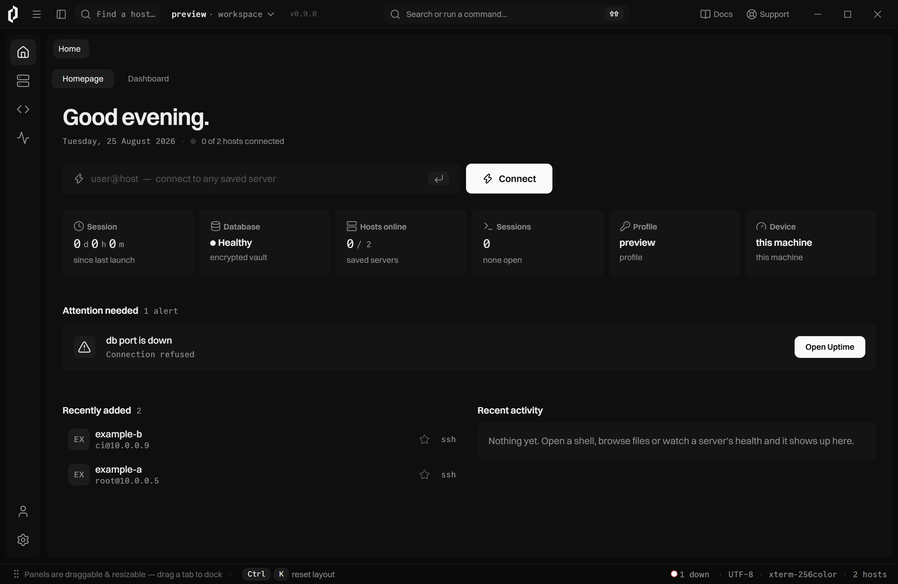
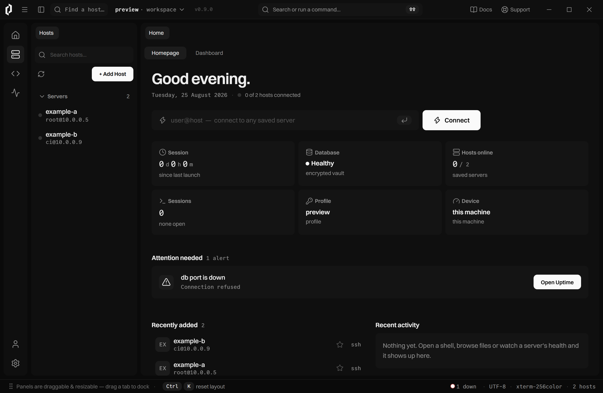
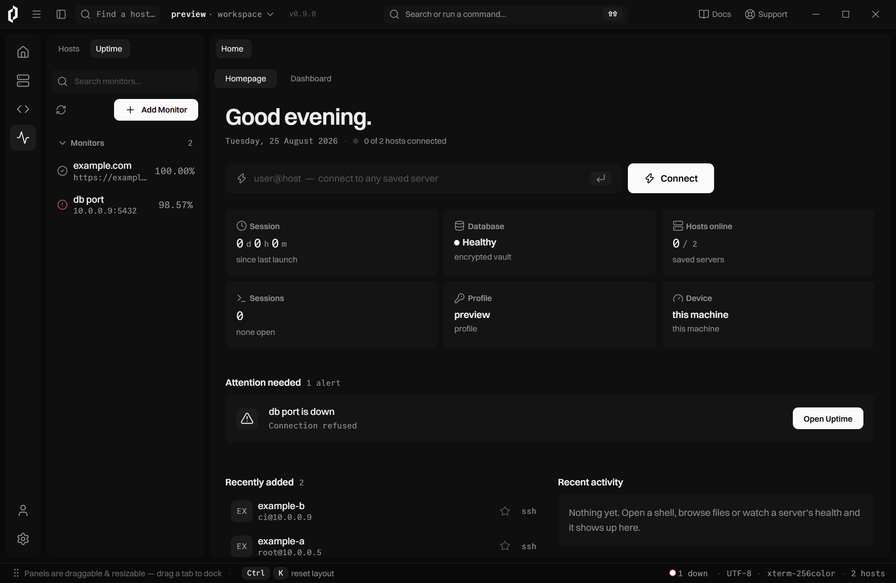
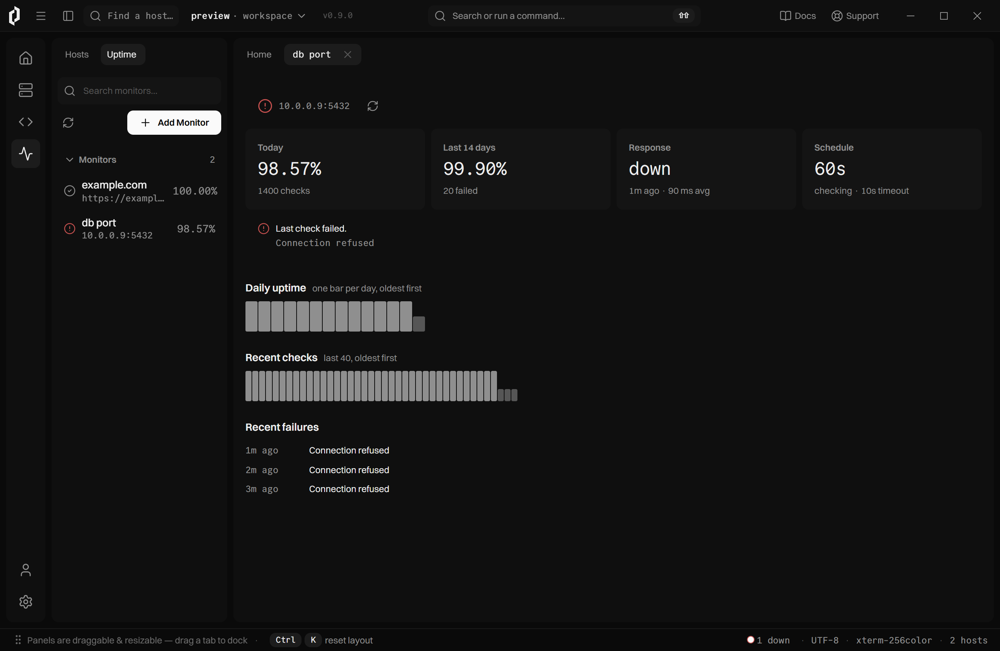

<picture>
  <source media="(prefers-color-scheme: dark)" srcset=".github/assets/hero-dark.svg">
  <source media="(prefers-color-scheme: light)" srcset=".github/assets/hero-light.svg">
  
</picture>

<br>

<p>
  
  
  
  
</p>

**Contents** — [Overview](#overview) · [Features](#features) · [Screenshots](#screenshots) · [Platform support](#platform-support) · [Installation](#installation) · [Development status](#development-status) · [Privacy](#privacy-as-a-table-instead-of-a-slogan) · [Contributing](#contributing) · [Donate](#donate) · [Sponsors](#sponsors) · [License](#license)

---

## Overview

**Portal** is a desktop app for managing your servers over SSH. It keeps your hosts,
keys and passwords in an encrypted vault **on your own disk**, and it never talks to
a server we run — because there isn't one.

It is built for two people at once: the person who has been living in a terminal for
ten years, and the person who bought their first VPS last week and doesn't know what
a fingerprint is. Advanced features are not hidden from the second person. They are
explained.

### Why another SSH client

|                        | Termius                    | Termix                        | **Portal**                            |
| ---------------------- | -------------------------- | ----------------------------- | ------------------------------------- |
| How you run it         | Desktop + mobile app       | **Docker web panel**          | **One desktop app**                   |
| Account required       | **Yes**                    | Local user (+OIDC)            | **No. Nothing to sign up for.**       |
| Where your data lives  | Company cloud (Pro)        | A server you host             | **Your disk, encrypted**              |
| Price                  | Free tier / Pro $10 mo     | Free, open source             | **Free — personal and commercial**    |
| Protocols              | SSH · SFTP · port fwd      | SSH · RDP · VNC · Telnet      | SSH · SFTP · tunnels                  |
| Docker management      | —                          | Yes                           | Planned (v1.1)                        |
| External uptime checks | —                          | —                             | **Yes — HTTP + TCP, with history**    |
| Built-in AI            | **Yes, cannot be removed** | —                             | Planned — *local by default, optional, removable* |
| If you're new to SSH   | Assumes you know           | Assumes you know              | **Teaches you**                       |

**Where Portal is weaker, plainly:**

- Windows only today. macOS and Linux are planned, not shipped.
- No mobile app and no browser access. That is the cost of being local-first.
- Fewer protocols than Termix. No RDP, VNC or Telnet yet.
- Uptime checks only run while the app is running. A tray option keeps it alive after
  you close the window; a true background service is out of scope.

We would rather you read that here than discover it after installing.

---

## Features

**Hosts** — folders, tags, fuzzy search, favourites, per-host notes, and a command
palette on double-shift.

**Terminal** — a real PTY over SSH rendered with xterm.js. Colour, resize, scrollback,
several sessions per host, each one a tab you can split and rearrange.

**Files** — two-pane SFTP between this PC and the host. Drag and drop in either
direction, a transfer queue with progress and cancel, and remote files opened
in-place in your own editor.

**Monitor** — CPU, RAM, disk, network, top processes and every mounted disk, with
history graphs. No agent to install; it reads `/proc`, `ps` and `df` over a single
exec.

**Uptime** — the part neither competitor ships: watch whether your sites and ports
are reachable **from outside**. HTTP(S) and raw TCP checks on your own interval,
per-monitor history, and a warning on the home screen the moment something drops.

**Vault** — Argon2id + XChaCha20-Poly1305, in an envelope design, so the same vault
can be opened three ways: your password, the OS keyring, or a **recovery phrase** you
wrote down when you set it up. Forgetting your password is not the end of your data.

**Sync (BYOS)** — "bring your own storage". Portal writes the encrypted vault into a
folder you choose: a local folder, your own Git repo, your own cloud drive, your own
server. We never see it, because we never hold it.

**Known hosts** — Portal keeps its own `known_hosts` and never touches `~/.ssh`. A
first-time key is explained before you trust it. A **changed** key is a loud warning
and a refused connection.

**Snippets** — saved commands, one click to run on the host you're looking at.

**Themes** — four, all monochrome, because colour is reserved for status.

Already implemented in the core library and coming to the interface in v1.1: SSH key
generation (Ed25519), `~/.ssh/config` import, port forwarding (local and SOCKS),
jump hosts / ProxyJump, and agent forwarding.

---

## Screenshots

<table>
<tr>
<td width="50%"></td>
<td width="50%"></td>
</tr>
<tr>
<td><b>Home</b> — what needs attention, and what you touched last</td>
<td><b>Hosts</b> — folders, tags, search; one click to open a server</td>
</tr>
<tr>
<td></td>
<td></td>
</tr>
<tr>
<td><b>Uptime</b> — is it reachable from outside, and for how long</td>
<td><b>A monitor's page</b> — daily uptime, the last 40 checks, recent failures</td>
</tr>
</table>

<sub>Sample data. Terminal, Files and Monitor need a real server, so their
screenshots come with the first release.</sub>

---

## Platform support

| Platform | Status |
| --- | --- |
| **Windows 10 / 11 (x64)** | ✅ **Supported.** The development platform. |
| macOS | ⏳ Planned for v1.5. The core is already cross-platform; packaging, notarisation and platform shortcuts are not done. |
| Linux (X11 / Wayland) | ⏳ Planned for v1.5. Needs a fallback for machines with no keyring. |
| Mobile / browser | ❌ Not planned. Portal is local-first by design; there is no server to reach it through. |

The servers you connect **to** just need OpenSSH. The monitor reads `/proc`, `ps` and
`df`, so it expects Linux on the other end — everything else works against any SSH
server.

---

## Installation

> **There is no installer yet.** Portal is pre-1.0 and the signed `.msi` ships with
> v1.0. Until then, build it yourself — it takes about five minutes.

**Prerequisites**

- [Rust](https://rustup.rs) (stable)
- [Node.js](https://nodejs.org) 20 or newer
- [Tauri v2 prerequisites](https://v2.tauri.app/start/prerequisites/) for your OS.
  On Windows: the WebView2 runtime and the MSVC build tools.

**Run it**

```console
$ git clone https://github.com/nowte/portal
$ cd portal/crates/portal-gui
$ npm install
$ npm run tauri dev
```

**Build a release binary**

```console
$ npm run tauri build
```

The bundle lands in `crates/portal-gui/src-tauri/target/release/bundle/`.

**Check the workspace**

```console
$ cargo fmt --all -- --check
$ cargo clippy --workspace --all-targets -- -D warnings
$ cargo test --workspace
```

---

## Development status

Portal is **pre-1.0**, written by one person, in the open. Here is an honest picture
rather than a roadmap full of promises.

**Where it is right now.** The application works. You can add a host, connect, get a
real shell, move files both ways, watch the machine, and watch your sites from the
outside — all of it against real servers, with everything sensitive encrypted at
rest. The domain core is around 7,500 lines of Rust with 117 tests, and the interface
is a thin shell over it.

**What is being worked on.** Depth, not new features. Before v1.0 every half-finished
edge gets closed: retry paths on every panel that can fail, search in the terminal,
multi-select in the file browser, concurrent uptime checks, a full keyboard map, and
an accessibility pass. The rule for this stretch is simple — **a half-built feature is
worse than a missing one**, and nothing ships to a launch page with a dead button on it.

**What comes after.**

| Version | Focus |
| --- | --- |
| **v1.0** | Depth pass · security hardening · signed `.msi` for Windows |
| v1.1 | Advanced SSH in the GUI (tunnels, jump hosts, key manager, `~/.ssh/config` import) and **Docker management** |
| v1.2 | **RDP / VNC** — more than one protocol |
| v1.5 | **macOS and Linux** |
| v2.0 | **AI assistant** — local model by default, your own API key optional, fully removable, and never allowed to run a command without showing you exactly what it will break |

**Pace.** This is a solo project with no company behind it and no funding round to
spend. It moves in evenings and weekends. Issues get read; large ideas may sit for a
while. If something matters to you, saying so in an issue genuinely changes the order
of the list.

**Where help is most useful right now:** testing against unusual servers, terminal
edge cases (odd `TERM` values, wide characters, resize behaviour), and telling us
where the interface confused you if you are new to SSH — that last one is the whole
point of the project and the hardest thing to see from the inside.

---

## Privacy, as a table instead of a slogan

Portal makes exactly three kinds of outbound connection, and you cause all three:

| Connection | When | To where |
| --- | --- | --- |
| SSH / SFTP | You connect to a host | The address **you** typed |
| HTTP(S) / TCP | An uptime monitor runs | The target **you** added |
| *(planned)* AI provider | Only if you turn AI on **and** choose a cloud model instead of a local one | That provider |

That is the whole list. No update pings, no crash reporting by default, no analytics,
no license check, no account. Telemetry exists as an off-by-default opt-in and never
includes host names, addresses, commands or file names.

Two things we tell you rather than hide:

1. The encrypted vault's file header stores a device label and a timestamp in **plain
   text**. The contents are encrypted; that metadata is not. If you sync the vault
   into a shared folder, that is what a reader learns.
2. Uptime checks stop when the app is closed. The tray option narrows that gap; it
   does not remove it.

Security reports: see [SECURITY.md](SECURITY.md). Please don't open a public issue.

---

## How it is put together

```
crates/portal-core/   all domain logic — SSH, SFTP, metrics, uptime, vault, sync
crates/portal-gui/    Tauri v2 + React desktop app (a thin shell over the core)
```

Two rules hold the project together:

1. **Every piece of domain logic lives in `portal-core`.** The interface only renders
   and collects input. No business logic in JavaScript.
2. **All async lives in the core.** The interface talks to it through a synchronous
   API and reads events off a channel.

Written in Rust with `#![forbid(unsafe_code)]` and no `unwrap`/`expect` in library
code, enforced by `clippy -D warnings` in CI.

---

## Contributing

Issues and pull requests are welcome — bug reports especially. If you are planning
something large, open an issue first so we can agree on the shape before you spend a
weekend on it.

- User-facing text is **English**. Error messages say what happened *and* what to do.
- Everything must pass the checks under [Installation](#installation).
- The visual design is a system, not a preference. If you touch the interface, follow it.

---

## Donate

Portal is free and will stay free — every feature, for everyone, personal and
commercial. There is no paid tier to upgrade to and no licence key to buy.

If it saves you time and you want to put something behind it:

**[💛 Sponsor on GitHub](https://github.com/sponsors/nowte)**

Nothing is locked behind this. You will never see a reminder inside the app.

---

## Sponsors

No sponsors yet — this section is here waiting for the first one.

If you or your company depend on Portal and want to support the work, sponsorship is
the most direct way, and you are welcome to be listed here.

---

## License

Portal is released under the **GNU General Public License v3.0** — see [LICENSE](LICENSE).

In plain words:

- Use it for anything, including at work. No fee, no key, no permission needed.
- Read it, change it, fork it, ship your own build.
- If you distribute a modified version, it stays under the GPL and stays open. You may
  not take Portal, close the source, and sell it as your own product.

The **name "Portal" and the logo are not covered by that license.** A fork is welcome;
a fork pretending to be Portal is not. Please pick your own name and mark.

Bundled third-party assets and their licenses are listed in
[THIRD-PARTY.md](THIRD-PARTY.md).
